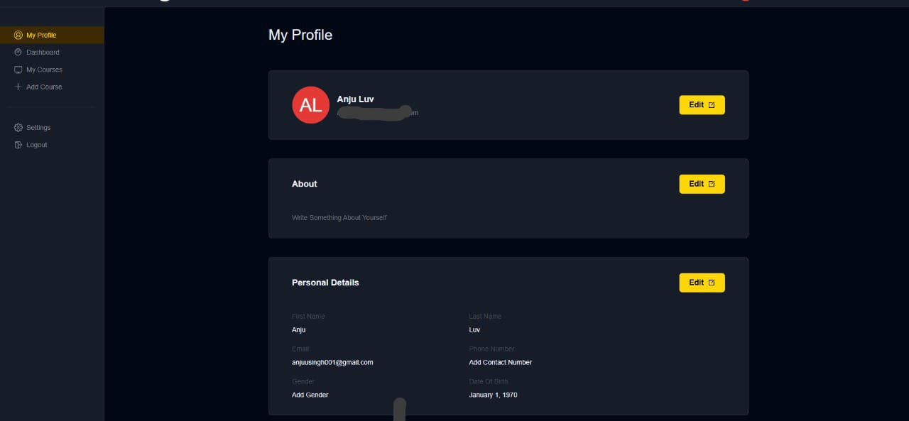
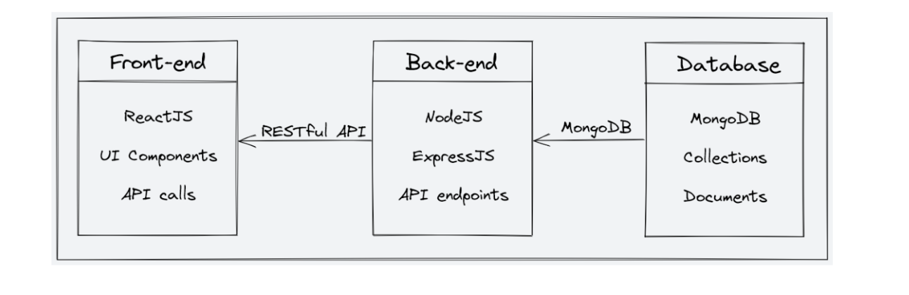
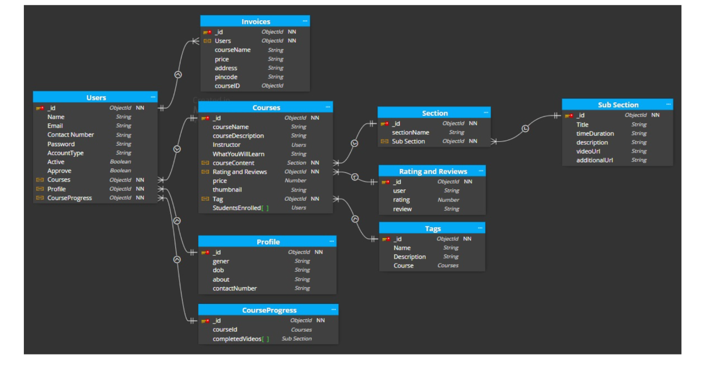

# 🎓 StudyNotion — An Ed-Tech Learning Platform

**Live Demo:** https://studynotion-frontend-steel-sigma.vercel.app/  
StudyNotion is a full-stack Ed-Tech platform built on the **MERN Stack**, enabling students to **learn**, instructors to **teach**, and users to **rate & review** courses — all in one interactive system.

---

## ✨ Features

### 👩‍🎓 For Students
- Browse and explore courses
- Add courses to wishlist
- Purchase courses securely (Razorpay Integration)
- Access complete course content & track progress
- Rate and review courses

### 👨‍🏫 For Instructors
- Create and manage courses
- Upload videos, documents, and chapter content
- Track student engagement and ratings
- Edit profile and instructor details

### 🔐 Authentication & Security
- Secure login/signup with **JWT**
- **OTP** verification using email
- **Bcrypt** password encryption

---

## 🖼️ Screenshots

### Home Page


### Course Page


---

## 🏛️ System Architecture


---

## 🗄️ ER Diagram


---

## 🧱 Tech Stack

| Layer        | Technology Used |
|--------------|----------------|
| Frontend     | React.js, Redux Toolkit, Tailwind CSS |
| Backend      | Node.js, Express.js |
| Database     | MongoDB Atlas |
| Media Storage| Cloudinary |
| Payments     | Razorpay |
| Authentication| JWT, Bcrypt |

---

## 🚀 Deployment

| Service      | Platform |
|-------------|----------|
| Frontend     | Vercel |
| Backend      | Render |
| Database     | MongoDB Atlas |
| Media Files  | Cloudinary |

---

## 🗂️ Project Structure


StudyNotion/
│── frontend/ # React UI
│── backend/ # Express server & APIs
│── database/ # MongoDB Atlas
│── media/ # Cloudinary (external)


---

## 🔌 API Highlights (REST)

| Method | Endpoint | Description |
|--------|----------|-------------|
| POST | /auth/signup | User registration |
| POST | /auth/login | Login & generate token |
| GET | /course/getAllCourses | Fetch all courses |
| POST | /course/createCourse | Instructor creates course |
| POST | /payment/capturePayment | Razorpay payment |
| POST | /course/createRating | Add review/rating |

All API responses are JSON and follow REST standards.

---

## 🛠️ Local Setup

```bash
# Clone the repository
git clone https://github.com/YOUR_USERNAME/StudyNotion.git

# Install backend dependencies
cd backend
npm install

# Install frontend dependencies
cd ../frontend
npm install
```

Environment Variables (.env)

Backend
```bash
MONGODB_URI=YOUR_MONGO_DB_URI
JWT_SECRET=YOUR_SECRET_KEY
CLOUDINARY_KEY=...
CLOUDINARY_SECRET=...
RAZORPAY_KEY=...
RAZORPAY_SECRET=...
```
Frontend
```
REACT_APP_BASE_URL=https://your-backend.onrender.com/api/v1
```
Future Enhancements
| Feature                                    | Impact                                     | Priority |
| ------------------------------------------ | ------------------------------------------ | -------- |
| Trie-based Smart Search                    | Faster and more intuitive course search    | ⭐⭐⭐⭐☆    |
| Personalized Recommendations               | Suggest courses based on learning patterns | ⭐⭐⭐⭐⭐    |
| Gamification (badges, XP, leaderboard)     | Boosts user engagement                     | ⭐⭐⭐☆☆    |
| Social Learning (Groups, Discussion Rooms) | Collaborative learning environment         | ⭐⭐⭐☆☆    |
| Mobile App (React Native)                  | Broader accessibility                      | ⭐⭐⭐⭐⭐    |

Conclusion

StudyNotion is built to provide an interactive, scalable, and user-friendly learning experience.
It bridges the gap between students and instructors with seamless content delivery, secure transactions, and intuitive UI.

⭐ If you like this project, don't forget to star the repository!
