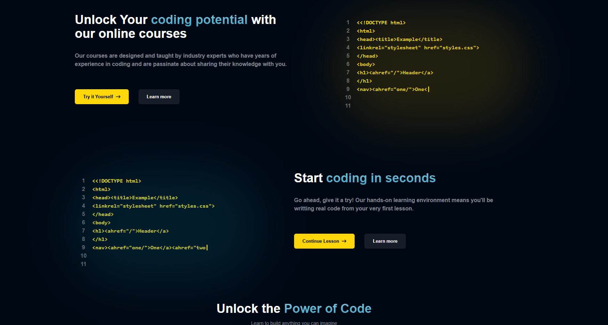

# 🎓 StudyNotion — Full-Stack EdTech Platform

StudyNotion is a full-stack online learning platform built with **React, Tailwind CSS, Node.js, and MongoDB**.  
It provides separate dashboards for **Admin, Instructor, and Student** users — enabling seamless course creation, management, and learning experiences.

---

## 🚀 Features

- 🔐 **Secure Authentication** — JWT-based login with role-based access control  
- 📚 **Course Management** — Create, publish, and enroll in courses  
- 💳 **Payment Integration** — Real-time transaction confirmation  
- 🧠 **Personalized Learning (Future Scope)** — Trie-based search and recommendation algorithms  
- 💻 **Responsive UI** — Built with React & Tailwind CSS for all devices  
- ⚙️ **Scalable Architecture** — Ready for future AI-driven upgrades  

---

## 🖼️ Preview

> *UI Previews (Development Mode)*  




---

## 🧩 Tech Stack

**Frontend:** React.js, Tailwind CSS  
**Backend:** Node.js, Express.js  
**Database:** MongoDB  
**Auth:** JWT Authentication  
**Payments:** Razorpay (or Stripe, if used)

---

## 🛠️ Setup Instructions

1. **Clone the Repository**
   ```bash
   git clone https://github.com/yourusername/StudyNotion.git
   cd StudyNotion
3. ** Install Dependencies
   ```bash
   npm install
4. Setup Environment Variables

Create .env file in the root directory

Add MongoDB URI, JWT Secret, Payment keys, etc.
5. Run the App
  ```bash
npm run dev
```
6.** Backend
   ```bash
  cd server
npm install
npm start
```
🧠 Future Enhancements

-> AI-based course recommendations

-> Real-time chat & discussion forums

-> Advanced analytics for instructors
